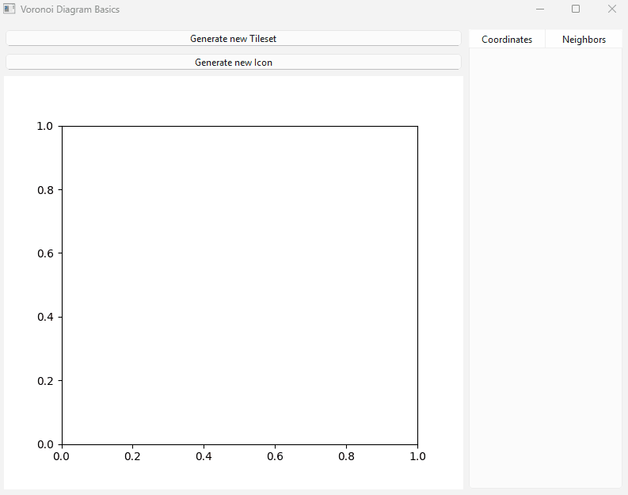
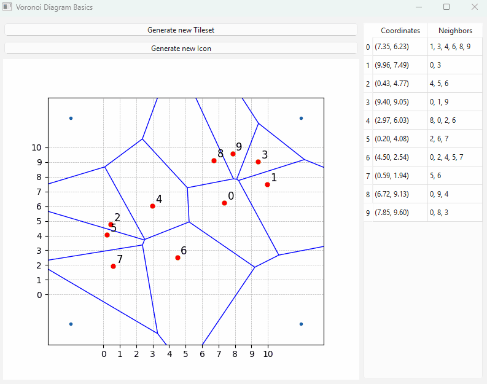

# A blueprint for creating randomized cells for a tile set

A great way to procedurally generate cells for a map. The voronoi diagram creates something more varied than a hexagon based grid.

# Also includes a rng icon maker

Uses the same basics to create new icons
